# Architecture Diagrams & Flows

Version: 2.0 · Date: 2026-09-13

Visual companion to the specs. Diagrams use Mermaid (renders on GitHub). Text
authority remains the linked docs.

---

## 1. Runtime architecture

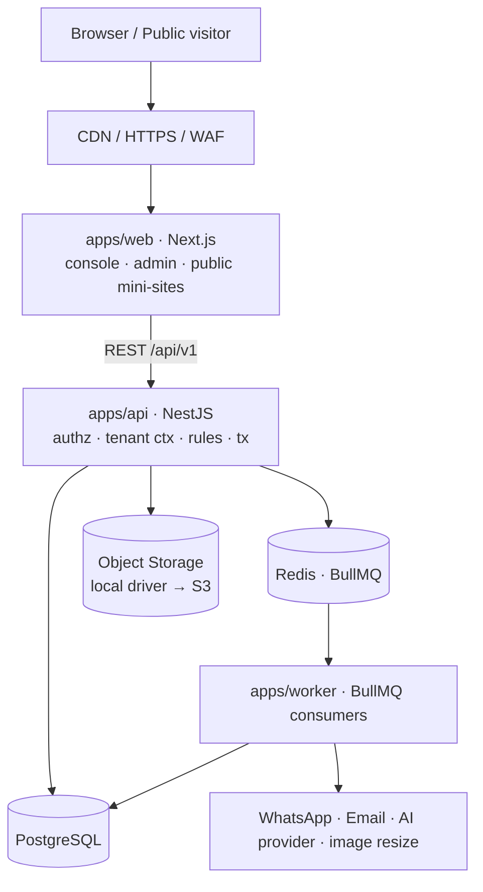

## 2. Inter-module messaging (bus + queue + outbox)

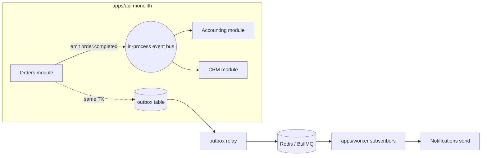

## 3. Authorization — entitlement then permission

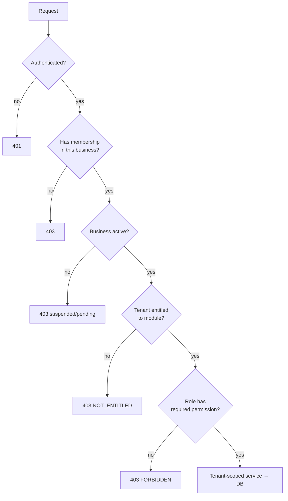

## 4. Tenant resolution

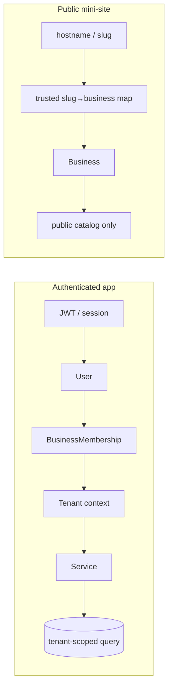

## 5. Order — two orthogonal state machines

**Axis A — fulfillment**

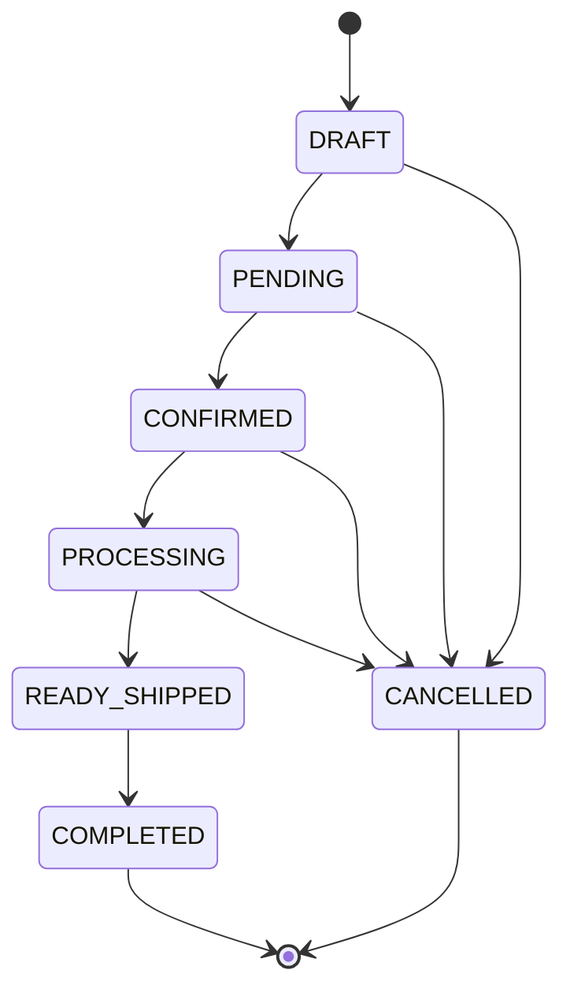

**Axis B — payment (derived from payment records)**

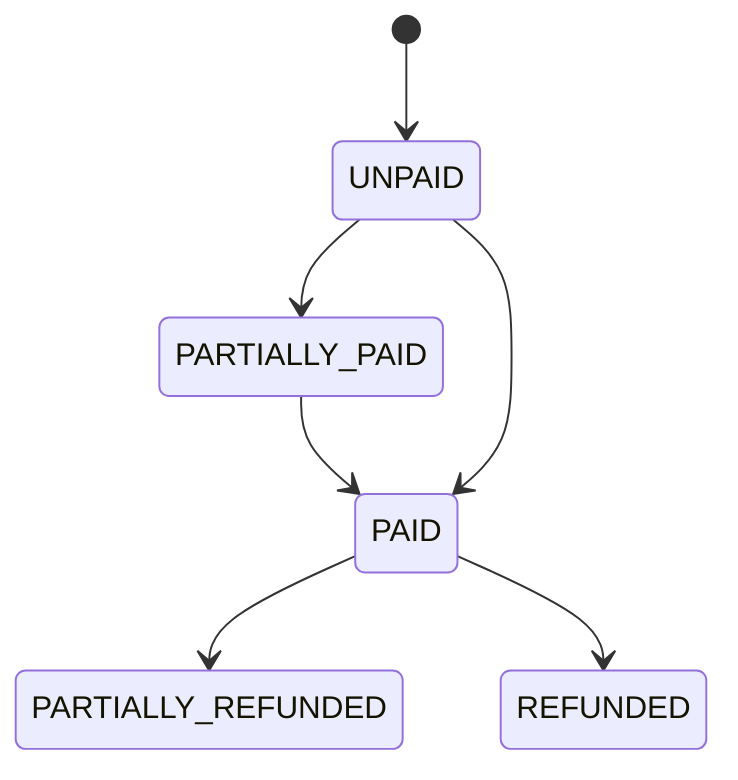

## 6. Payment → cash-basis income (the trigger rule)

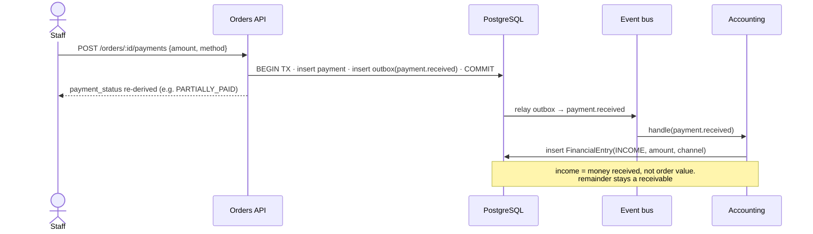

## 7. Order / money — ERD slice

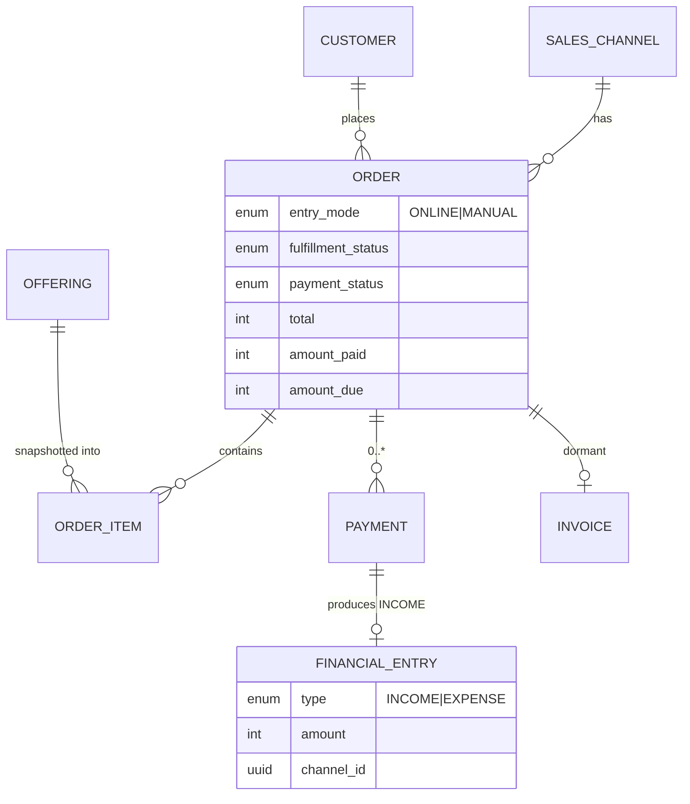

## 8. Mini-site WhatsApp order handoff (MVP)

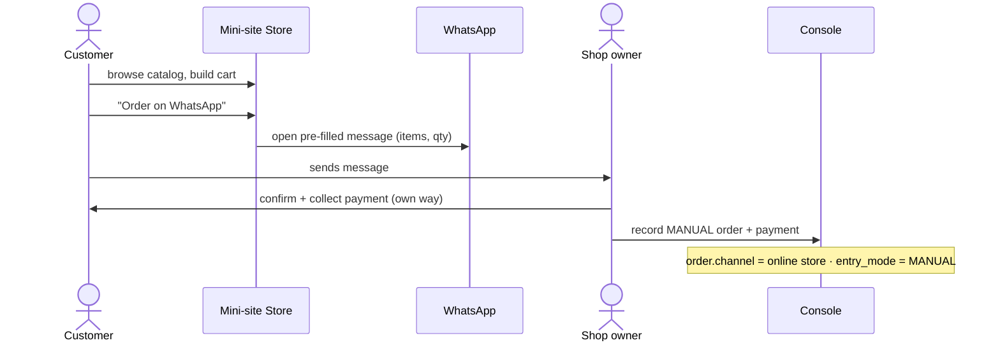

## 9. AI agent tool call

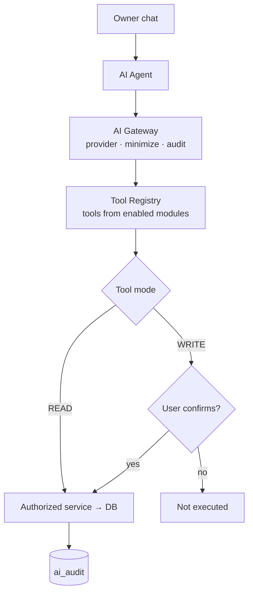

## 10. Business onboarding lifecycle

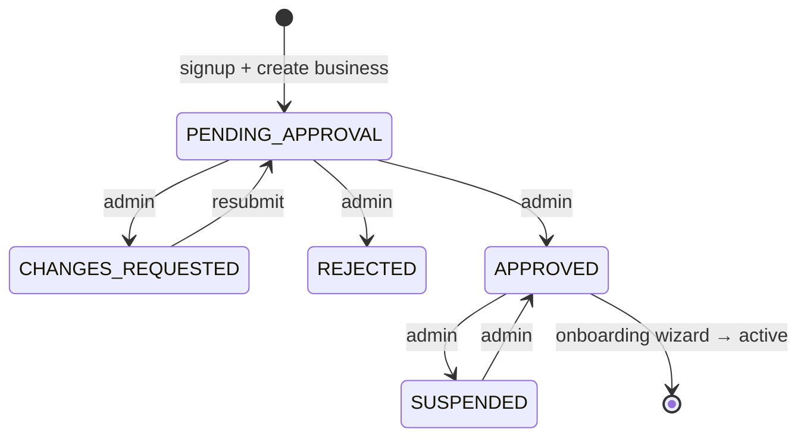

## 11. Module lifecycle

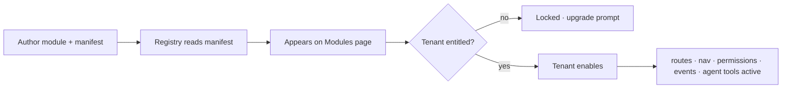

## 12. Lovable ⇄ Claude CLI delivery loop (contracts-first)

```mermaid
sequenceDiagram
    participant C as Claude CLI
    participant G as GitHub repo
    participant L as Lovable
    C->>G: define Zod contracts + API + migrations (feat/be-*), push
    C->>G: open PR → main after tests + security review
    G-->>L: Lovable "Sync from GitHub" (pull main)
    L->>G: build UI against contracts (feat/ui-*), push
    G-->>C: Claude pulls feat/ui-*, reviews security/perf, wires, tests
    C->>G: merge to main
    Note over C,L: main is the shared interface; contracts change only via Claude
```
